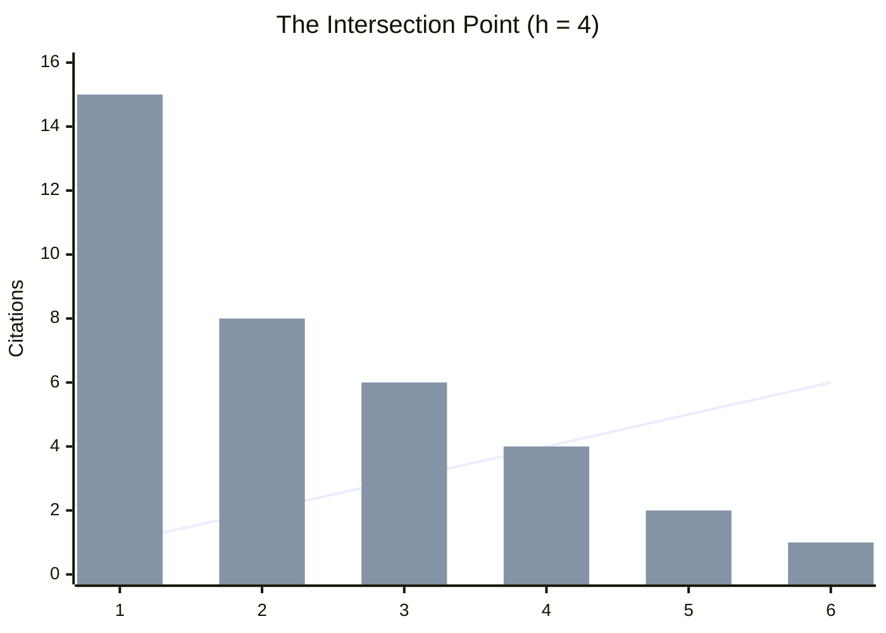

## 1. Bibliometría y el índice h (h-index)

### Definición y Propósito
- **¿Qué es?** Métrica propuesta por J.E. Hirsch (2005) para estimar la importancia, impacto y productividad de un investigador de manera imparcial.
- **Objetivo:** Comparar de forma objetiva a diferentes investigadores basándose en logros científicos.

### Críticas principales del h-index
- Favorece artículos con muchos autores
- Ignora la posición del autor en la lista de autores
- No considera el contexto de las citas (favorable vs. crítica, citación en introducción vs. en resultados)

### Variabilidad del h-index
- No existe "un solo" índice h — varía según la base de datos:
  - Google Scholar
  - Scopus (Elsevier)
  - ISI – Web of Knowledge
  - Microsoft Academic Search
- **Variantes:** sobre últimos x años, con/sin autocitas, para instituciones

### Vulnerabilidades y Manipulación
- **Ejemplo de fraude:** Crear autores ficticios con documentos falsos y citas infladas en Google Scholar
- Google Scholar no corrigió las citas falsas (774 citas ficticias en un caso documentado)
- **Conclusión:** El sistema es fácil de manipular

### Ranking de Conferencias y Revistas
- **CORE** (Computing Research and Education Association of Australasia) clasifica conferencias y revistas de informática
- Basado en solicitudes de investigadores con argumentos detallados
- Se apoya en Google Scholar y ArnetMiner para decisiones

---

## 2. Revisión por Pares (Peer Review)

### Definición de "Par"
- Etimológicamente: "An equal in rank or status" (c.1300)
- En academia: Investigador o profesional del mismo nivel que decide sobre publicaciones, financiamiento y contratación

### Especialidades en Revisión por Pares
- **Revisión editorial:** Qué artículos se publican
- **Revisión de fondos:** Qué proyectos se financian
- **Contratación:** Decisiones sobre investigadores y profesores

### Revisión en Conferencias
- **Estructura:** Program Committee (PC) con chairs, area chairs y miembros
- **Proceso:**
  - Plazos estrictos (4-6 semanas)
  - 5-10 artículos por revisor (revisión en lote)
  - Decisión binaria: aceptar/rechazar
- **Organización:** Papers distribuidos entre miembros del PC

### Revisión en Revistas/Journals
- **Estructura:** Editorial board con editor(s) en jefe y miembros
- **Proceso:**
  - Un editor se asigna a cada paper
  - Se solicitan ~3 revisores expertos
  - Tiempo: 4-6 semanas (extensible)
- **Decisiones graduales:**
  - Aceptar tal cual (raro)
  - Aceptar con revisiones menores (raro)
  - Revisión y reenvío
  - Rechazar

---

## Ejemplo: Índice h (h-index)

### Definición Formal
Un investigador tiene un índice **h** si **h** de sus publicaciones tienen al menos **h** citas cada una.

### Ejemplo Práctico
Supongamos un investigador con 6 artículos ordenados por número de citas (mayor a menor):

| Posición | Citas | ¿Cumple (Citas ≥ Posición)? | Explicación |
|:---:|:---:|:---:|---|
| 1 | 15 | ✓ Sí | 15 ≥ 1 |
| 2 | 8 | ✓ Sí | 8 ≥ 2 |
| 3 | 6 | ✓ Sí | 6 ≥ 3 |
| **4** | **4** | **✓ Sí** | **4 ≥ 4 → h-index = 4** |
| 5 | 2 | ✗ No | 2 < 5 |
| 6 | 1 | ✗ No | 1 < 6 |

**Resultado:** Este investigador tiene un **índice h = 4**, lo que significa que tiene 4 artículos que han sido citados al menos 4 veces cada uno.

### Gráfico

**Explicación Visual:**
- **Eje X (horizontal):** Número de artículos, ordenados por cantidad de citas (de mayor a menor)
- **Eje Y (vertical):** Número de citas que recibió cada artículo
- **Línea diagonal:** Representa la condición `citations = papers` (la frontera del h-index)
- **Puntos dispersos (scatter):** Muestran las citas reales de cada artículo
- **Punto de corte:** Donde la línea intercepta es el h-index

**Interpretación del Ejemplo:**
- **Art 1:** 15 citas (15 ≥ 1) ✓
- **Art 2:** 8 citas (8 ≥ 2) ✓
- **Art 3:** 6 citas (6 ≥ 3) ✓
- **Art 4:** 4 citas (4 ≥ 4) ✓ ← **h-index = 4**
- **Art 5:** 2 citas (2 < 5) ✗
- **Art 6:** 1 cita (1 < 6) ✗

**Conclusión:** Este investigador tiene **h-index = 4** porque tiene 4 artículos con al menos 4 citas cada uno.
